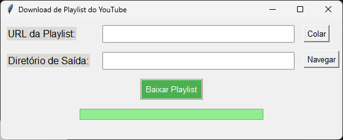

# 🎵 YouTube Playlist Downloader 📥

## Descrição

O YouTube Playlist Downloader é uma aplicação simples que permite baixar uma playlist do YouTube em apenas alguns cliques!  
Com uma interface simples, você pode salvar suas músicas preferidas para ouvir offline. Além disso, é ótimo para baixar cursos e tutoriais para assistir quando estiver sem internet!

## 🛠️ Tecnologias Utilizadas

- Python 🐍
- Tkinter 💻
- youtube_dl 🎬

## Como Usar

1. **Clone ou Baixe o Repositório:** `git clone https://github.com/Jaoow/youtube-playlist-downloader.git`
2. **Instale as Dependências:** `pip install youtube_dl`
3. **Execute o Script:** `python youtube_playlist_downloader.py`
4. **Cole a URL da Playlist:** Ou insira manualmente na caixa de texto.
5. **Escolha o Diretório de Saída:** Clique em "Navegar" para selecionar onde salvar os arquivos.
6. **Clique em "Baixar Playlist":** E aguarde o download terminar.

## 📸 Capturas de Tela

  
_Interface Principal_

## 📝 Notas

- Verifique se a playlist que você está tentando baixar é pública. Não é possível baixar playlists privadas.
- O processo de download pode levar algum tempo, dependendo do tamanho da playlist e da velocidade da internet.
- Esta aplicação foi testada apenas em sistemas Windows.

## 🌟 Autor

- João Lucas 🚀
